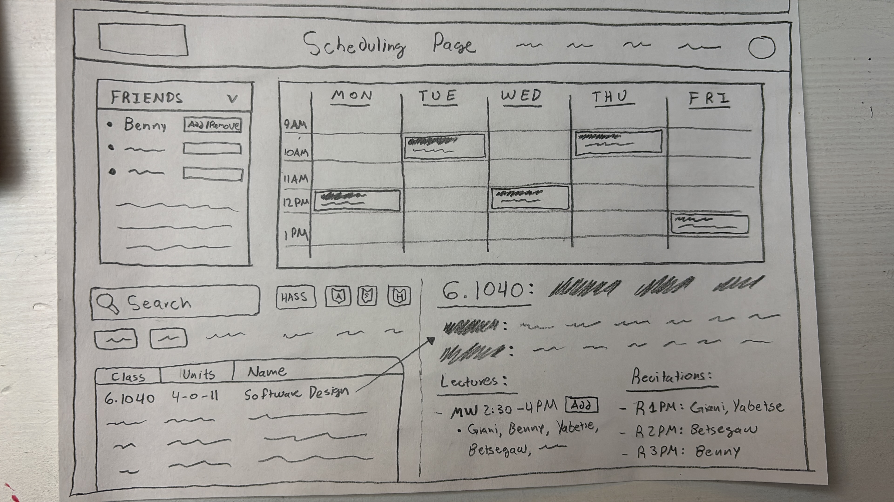

# UI Sketches

## **1. User Page**

### **Sketch :**

### **Notes**

* **Friends:** Allow users to see current friends and add/remove them.
* **Foes:** Allow users to see current blocked users and unblock them, or block more.
* **Groups:** Allow users to see current groups and add/remove them.

## **2. Scheduling Page**

### **Notes**

* **Friend Dropdown:** Allow users to select other groups to see and include student schedules from those groups.
* **Search Filtering:** Using key filtering allows searching for courses they want.
* **Course Description:** Includes additional basic information that may be necessary. Most importantly, include information regarding what friends are taking which lectures/recitations.

## **Previous Iterations**

Previous sketches that were changed/updated. They are included here for future reference.

### **Course Catalog Page**

### **Course Page**

### **Scheduling Page**

